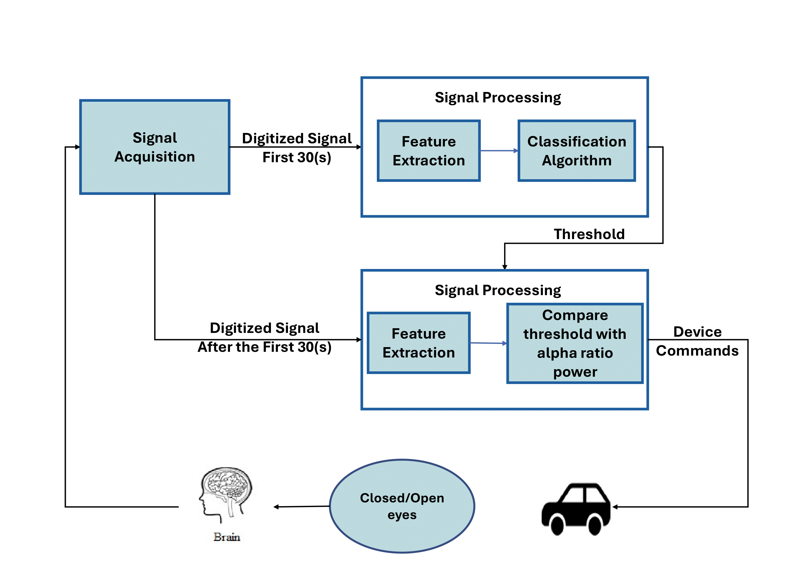
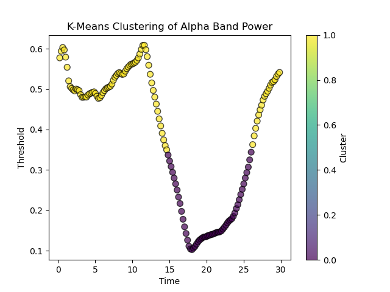
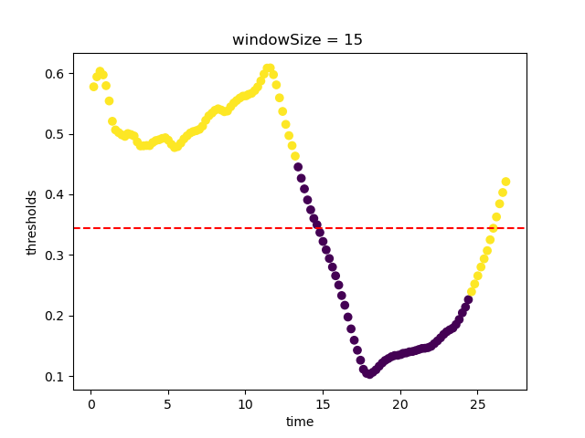

<h1 align="center">Adaptive EEG classification model</h1>

> [!NOTE]
> The adaptive model enables the EEG acquisition process to be automated. Our recent method utilized a K-means model to collect data in 30-second intervals for training.
> Once trained, the model can be applied in real-time to control a mind-controlled car.

## Pipeline

  

Our pipeline consists of three main parts:
1. **EEG acquisition**: EEG Cap, Cygnus
2. **Signal Processing**:
  - An automated pipeline over 30 seconds (10 seconds with eyes closed, 10 seconds with eyes open, and another 10 seconds with eyes closed)
3. **Device Commands**: Control of the car is based on the alpha power ratio

## Results
### Kmeans

  
  

